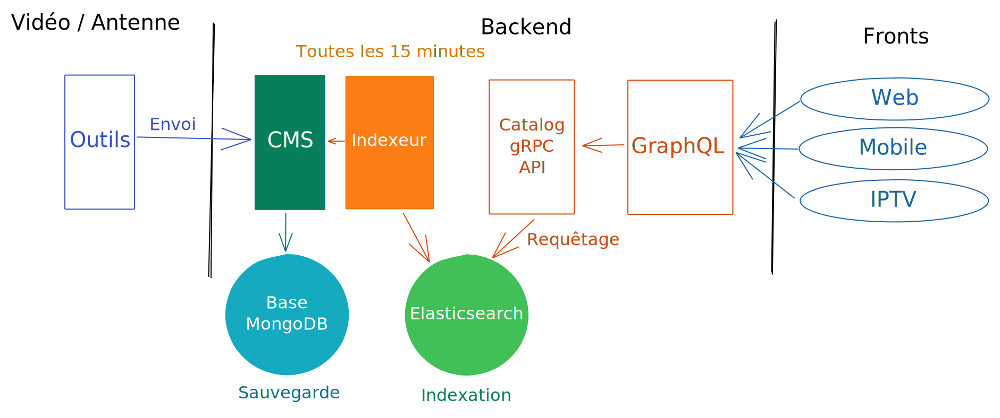
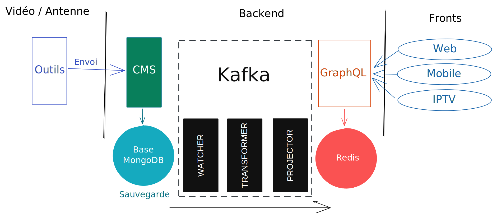
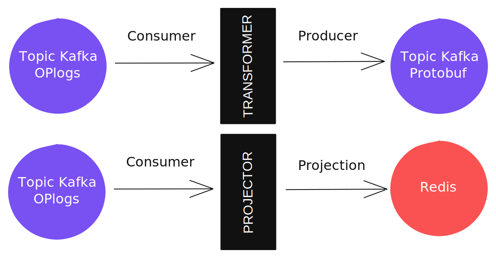

## Historique

Comme vous avez pu le découvrir sur notre article [Tour d'horizon technique](https://tech.tf1.fr/post/2020/architecture/presentation/), notre stack backend est chargée d'exposer les données aux différents fronts.

L'idée étant que nous récupérons des données provenant des équipes vidéos maintenant un référentiel des données proches de l'antenne et notre rôle est d'**éditorialiser et transformer les données** afin qu'elles soient exploitables sur les différents fronts digitaux (Web, Mobile et IPTV) via une gateway GraphQL également gérée par notre équipe backend.

Jusque là, notre architecture ressemblait à la suivante :

Globalement, après récupération des données fournies par l'équipe vidéo, nous stockons ces données dans une base de données [MongoDB](https://www.mongodb.org), utilisée par le CMS pour l'éditorialisation de celles-ci.

La suite du workflow est déclenchée par notre job nommé "Indexeur" (exécuté périodiquement, toutes les 15 minutes) qui, comme son nom l'indique, va s'occuper de l'**indexation** mais aussi de la **transformation** des données stockées dans le CMS afin qu'elles soient pré-formattées pour les besoins des différents fronts.

Une fois stockées dans le moteur [Elasticsearch](https://www.elastic.co/fr/elasticsearch/), lorsqu'un front fait un appel à notre gateway GraphQL, celle-ci contacte une API gRPC (Catalog API sur le schéma) qui va s'occuper de récupérer les données Elasticsearch et de les formatter sous forme d'objets Protobuf bien définis à GraphQL. Les résolveurs GraphQL s'occupent ensuite d'exposer ces objets aux fronts.

Cette mécanique fonctionne correctement et est même résiliente car en cas de soucis sur notre brique d'indexation, elle permet de ne pas impacter les fronts qui disposeront toujours de la dernière version à jour.

Cependant, principalement pour des besoins d'éditorialisation, nous souhaitions supprimer ces 15 minutes d'attente entre chaque indexation et avoir un workflow beaucoup plus **temps réel** et [event-driven](https://en.wikipedia.org/wiki/Event-driven_programming), dans notre workflow interne mais aussi pourquoi pas via des événements utilisateur par la suite.

Nous avons rapidement identifiés [Apache Kafka](https://kafka.apache.org/) comme un excellent outil nous permettant de gérer nos **événements** mais surtout nous garantir la bonne **persistance** de ceux-ci.

## Découpage en lots

Nous avons donc commencer à réfléchir à la nouvelle architecture à mettre en place et avons décidés d'**itérer en lots** afin d'avoir des premiers résultats visibles rapidement pour nos utilisateurs.

En effet, l'outil identifié, il nous fallait maintenant voir si Kafka et son éco-système principalement Java pouvait co-éxister avec notre stack technique en [Go](https://www.golang.org).

Nous avons donc voulu **commencer par des choses simples**, produire et consommer des messages depuis un topic Kafka puis ensuite manipuler ces données au travers de streams des topics Kafka.

Les lots identifiés sont donc les suivants :

* Lot 1 : **Récupérer les données à jour** depuis la source de données principale (la base de données CMS MongoDB) afin de les exposer dans un Redis à GraphQL,
* Lot 2 : Pouvoir **manipuler les données en temps réel** (streams de données) afin de calculer des valeurs à la volée,
* Lot 3 : Migrer les  **données utilisateur** dans Kafka afin d'avoir des événements utilisateur persistés
* Lot 4 et suivants : Pouvoir **planifier des événements** dans Kafka, de futurs besoins, dont on parlera dans de futurs articles !

Ces trois premiers lots nous permettaient déjà de mettre une grosse partie de la logique événementielle en place et de confirmer notre choix.

## Les débuts avec Kafka

Nous avons donc identifiés les outils à notre disposition pour commencer à régler les premiers besoins, tout en gardant à l'esprit que nous souhaitions garder [Protobuf](https://developers.google.com/protocol-buffers/) pour la serialisation des messages dans les topics Kafka et ainsi continuer à **échanger des objets clairement définis**.

[Confluent](https://www.confluent.io/) étant aujourd'hui un acteur et contributeur majeur sur Apache Kafka, c'est assez naturellement que nous avons commencé à utiliser son client [confluent-kafka-go](https://github.com/confluentinc/confluent-kafka-go).

Il nous permet de gérer nous-même la serialisation des données que nous souhaitons envoyer dans les topics Kafka et donc aucun soucis pour garder la gestion Protobuf.

Nous avons également commencer à repérer le fonctionnement autour de toute la suite Confluent avec notamment avec [ksqlDB](https://ksqldb.io/) et la [Schema Registry](https://docs.confluent.io/platform/current/schema-registry/index.html) mais nos essais n'ont pas été très concluants et ça nous semblait assez complexe à mettre en place.

## Lot 1 : Production de données dans Redis

Nous avons donc réfléchi à la mise en place de notre premier lot, pour rappel : **récupérer les données** mises à jour en temps réel depuis la base MongoDB, les **transformer en objet Protobuf** et les **projeter dans Redis**.

Notre architecture ressemblerait donc désormais à ceci :

### Récupérer les données MongoDB en temps réel

Bien que nous ayons vu l'existance d'un [connecteur MongoDB](https://www.confluent.io/hub/mongodb/kafka-connect-mongodb) fourni par Confluent écrit en Java, disposons d'une équipe expérimentée sur Go et MongoDB, nous avons tout de même souhaité essayer d'écrire notre propre connecteur en Go.

Nos tests étant concluants sur cette partie, nous l'avons écrit et rendu open-source à cette adresse : [https://github.com/etf1/kafka-mongo-watcher](https://github.com/etf1/kafka-mongo-watcher).

Nous avons besoin d'écouter les événements provenant des collections MongoDB suivantes :

* Chaîne
* Programme
* Video
* Personnalité

Globalement, le principe est d'utiliser la fonction de [watch](https://docs.mongodb.com/manual/reference/method/db.collection.watch/) de collection fournie par MongoDB et notre application s'occupe ensuite de produire les logs d'opération (appelés [oplogs](https://docs.mongodb.com/manual/core/replica-set-oplog/)) générés dans un topic Kafka pour un traitement ultérieur.

### Produire des messages Protobuf ou les projeter

Une brique de transformation (Transformer sur le schéma) prend ensuite le relai et récupère donc depuis le topic Kafka les oplogs MongoDB afin de les transformer en objet Protobuf. À ce stade, nous allons alors produire dans un nouveau topic Kafka l'objet Protobuf en question :

Étant donné que nous avons détecté ce besoin de **transformation** ou de **projection** assez fréquemment, nous avons également développé une librairie Go open-source permettant de définir une interface simple pour la transformation et la projection des données : [https://github.com/etf1/kafka-transformer](https://github.com/etf1/kafka-transformer).

La troisième brique (Projector) quant à elle consomme donc le topic produit par la brique précédente (Transformer) et transforme les données pour **chaque écran** avant de les stocker dans Redis.

Ainsi, lorsque GraphQL reçoit une requête provenant d'une application mobile, par exemple, les données sont **déjà pré-formattées dans Redis** pour leurs besoins spécifiques.

La dernière étape pour ce lot était simplement de brancher certaines requêtes GraphQL permettant de récupérer un contenu de façon directe (par son identifiant ou son slug) sur un data-loader permettant de récupérer les données serialisées en Protobuf directement dans Redis afin d'exploiter ces nouveaux objets (très ressemblants aux anciens).

## Lot 2 : Manipulation et stream de données

Ce second lot nous permettrait de confirmer que nous sommes capables de calculer, directement via un stream d'un ou plusieurs topic Kafka, des données et de les produire dans un second topic permettant d'avoir ces informations "enrichies".

Nous avons donc identifié un cas du côté de l'éditorialisation : les **recommandations éditoriales**.

Sur une page programme, certaines sections présentées sont des recommandations éditoriales, par exemple, une section "Bonus" présentant uniquement les dix dernières vidéos de type "Bonus".

Ces sections sont **calculées dynamiquement** en fonction des règles définies dans le CMS et des vidéos attachées au programme et afin de les calculer en se basant sur nos topics Kafka, nous avons donc besoin de :

* **Construire un aggrégat** de toutes les vidéos (pouvant être exploitées) associées au programme,
* **Calculer les vidéos** devant faire partie de la sélection éditoriale, en fonction des filtres définis,
* **Enrichir l'objet** programme avec le calcul effectué et produire l'objet enrichi dans un nouveau topic, qui sera à son tour exploité pour la projection dans Redis.

Pour ce besoin, nous avons commencé par faire des essais avec [Kafka Streams](https://kafka.apache.org/documentation/streams/). Nous avions quelques a priori sur cette technologie du fait qu'il s'agisse d'une librairie Java, que peu de développeurs avaient des connaissances Java et qu'il fallait pouvoir gérer ça en production.

Nous nous sommes tout de même penchés en premier lieu sur cette solution et avons fait des essais concluant ! Nous avons aussi utilisés [Quarkus](https://quarkus.io/guides/kafka-streams) nous permettant d'améliorer les performances de l'application et de la déployer dans notre cluster Kubernetes en utilisant simplement le binaire généré en sortie.

Cependant, ayants des besoins de produire des aggrégats conséquents sur certains programmes, la consommation en ressources CPU et mémoire étaient tout de même assez élevés.

C'est pourquoi nous avons donc également testés la librairie open-source [Goka](https://github.com/lovoo/goka), écrite elle en Go, permettant de répondre à ce même besoin avec, en plus, le bénéfice de pouvoir écrire les applications en suivant **nos nomenclatures de développement** habituelles. Nous avons également observés de meilleures performances en terme d'utilisation de ressources mais aussi en temps d'exécution.

La solution Goka est donc maintenant retenue pour ce genre d'opérations. Toutefois, Goka ne permet pas de gérer certaines opérations que Kafka Streams gère comme les [fenêtres de temps](https://kafka.apache.org/11/javadoc/org/apache/kafka/streams/kstream/TimeWindows.html), qui nous seront certainement utiles pour de futurs besoins. Nous n'excluons donc pas avoir besoin de se tourner vers Kafka Streams pour certains besoins.

## Lot 3 : Données utilisateur dans Kafka

Lors de l'ajout en favoris d'un programme ou d'une vidéo par un utilisateur ou lorsqu'il commence à regarder une vidéo, des données le concernant sont enregistrées afin de pouvoir lui remonter les vidéos qu'il a commencé à regarder.

Ces besoins étaient auparavant gérés par deux micro-services et nous avons décidés de re-grouper ces deux micro-services en un seul : user-api

Concernant les données, elles étaient stockées sur un serveur Elasticsearch (plusieurs millions d'entrées) qui n'avait aucune plus value car nous n'effectuons pas de recherche full-text et les besoins en terme de requêtage sont très simples : nous récupérons simplement les données pour un utilisateur donné.

Nous en avons donc également profité pour migrer cette brique qui utilisait autrefois [RabbitMQ](https://www.rabbitmq.com/) pour l'asynchronisme vers Kafka. Nous avons gagnés en stabilité et en persistance de ce côté.

Côté stockage, nous avons remplacé Elasticsearch par [AWS DynamoDB](https://aws.amazon.com/fr/dynamodb/), base de données NoSQL managée par AWS nous permettant de stocker à moindre coût ce grand nombre d'entrées tout en nous permettant de requêter les données qui sont ensuite servies aux fronts.

## Conclusion

Pour finir, je préciserais que nous utilisons [AWS MSK](https://aws.amazon.com/fr/msk/), version de Kafka managée par AWS qui nous permet de tirer pleinement profit des APIs Kafka.
Nous n'avons à ce jour pas identifié de limitation.

Ces deux premiers lots nous ont permis de nous assurer que Kafka répondait à notre besoin afin de faire évoluer le workflow des données digitales de MyTF1.

Nous avons toutefois de nouveaux challenges que nous sommes en train de relever, notamment le fait de pouvoir planifier des messages dans Kafka, afin de faire expirer certaines données ou encore de déclencher des événements à certains moments définis dans le temps, par exemple.

N'hésitez pas à nous contacter si vous souhaitez avoir plus d'informations sur cette migration vers Kafka, nous serons ravis d'échanger sur ces problématiques.

Nous reviendrons également plus en détail sur nos briques open-source dans de futurs articles.