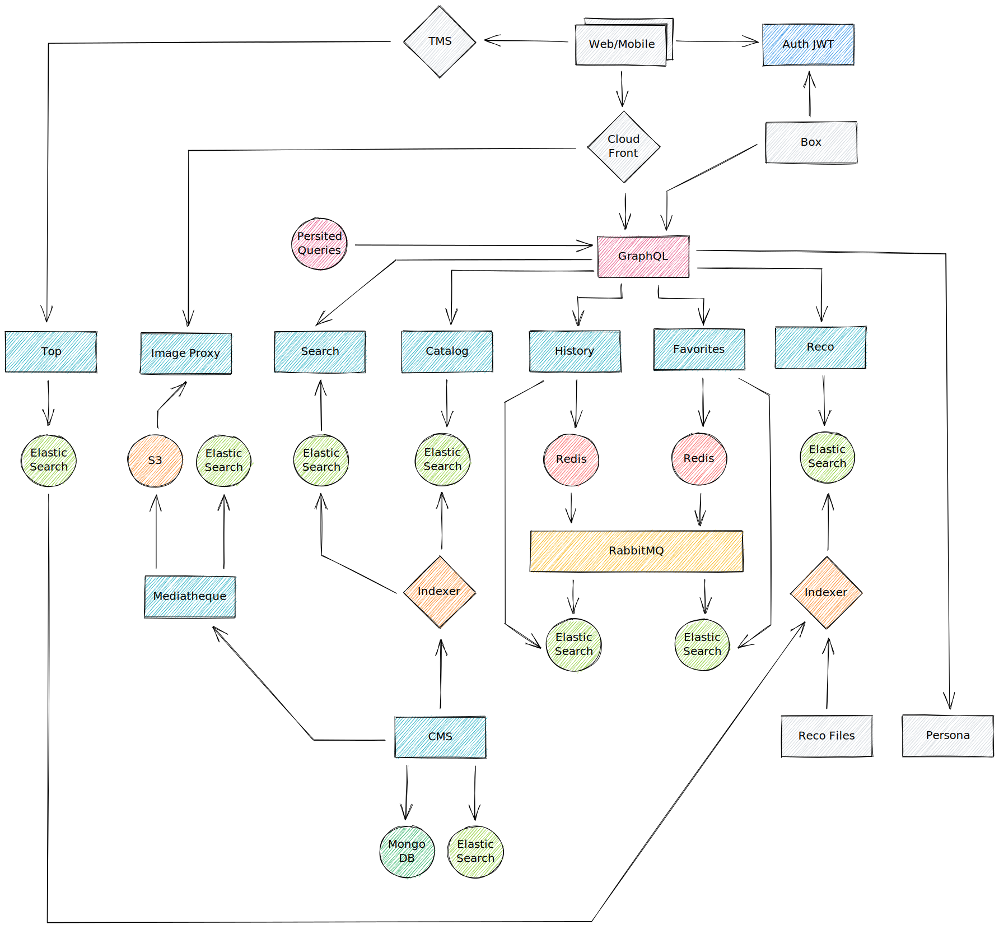
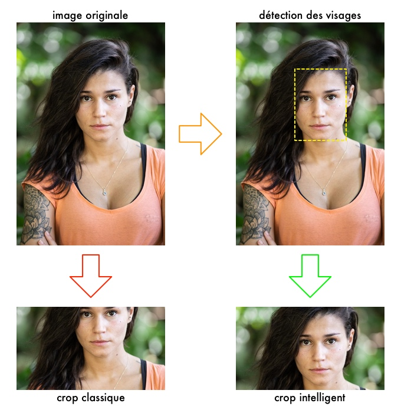
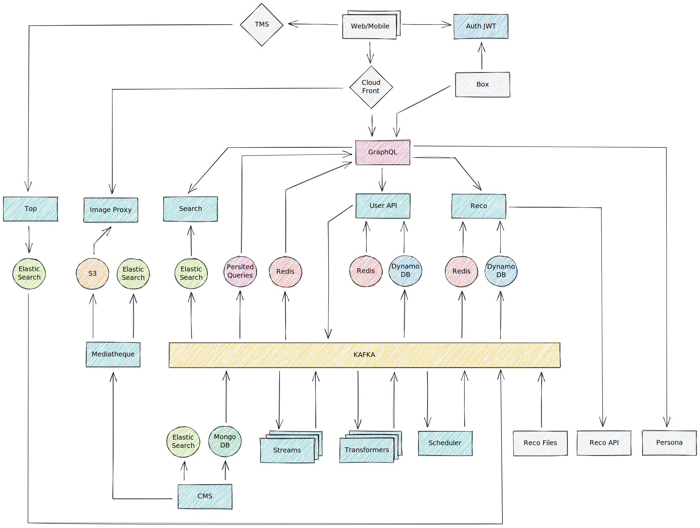

## Avant propos
Cet article a pour objectif de présenter l'équipe Backend et n'est en aucun cas une présentation technique détaillée des entrailles de MYTF1. Les aspects techniques seront abordés en détail dans des articles dédiés. Ici, nous nous concentrerons sur la composition de l'équipe, son histoire et partagerons avec vous quelques unes des décisions que nous avons prises ces dernières années. Bonne lecture.

## Qui sommes nous ?
Intégrée au sein de e-TF1 (antenne digital du groupe TF1) l’équipe Backend a pour objectif de répondre aux problématiques suivantes :
- Gérer la mise en ligne et l’animation éditoriale de notre contenu
- Stocker et restituer les données utilisateurs (historique et progression de lecture, programme favoris, bookmarks etc.)
- Exporter/partager notre catalogue de contenu avec nos partenaires (FAI, Salto, etc.)
- Fournir des API aux fronts pouvant supporter de fortes charges

Elle est composée d’une dizaine de personnes ayant des profils (développeur, product owner, lead tech, internes ou externes) et des niveaux d’expérience (débutant, expérimenté, stagiaire, alternant) différents. Depuis 2018 nous avons fait le choix d’investir fortement dans le langage Go qui représente aujourd’hui la quasi intégralité de notre base de code.

## Architecture et technologies
Nous avons fait le choix d’une architecture micro-services. Les différentes composantes métier sont réparties en services dédiés, qui communiquent principalement via GRPC.
Voici une liste non exhaustives de nos briques métier :
- CMS API : dédiée à l’animation éditoriale de notre contenu
- Catalog API : dédiée à la gestion de notre catalogue de contenu
- User API : dédiée à la gestion des données utilisateur
- Reco API : dédiée à la recommandation de contenu
- SEO API : dédiée  aux problématiques SEO
- Auth API : dédiée à l’identification de nos utilisateurs

Pour les applications MYTF1, nous avons fait le choix d’exposer à travers une API GraphQL une vision consolidée de ces services.
En effet, l’API GraphQL agit comme une API Gateway et se charge d’exposer un modèle de données cohérent et unifié qui répond aux besoins exprimés par les équipes produit/métier.
Elle a été conçue et créée avec une vision multi-écran et doit être capable de fonctionner aussi bien pour nos applications Web, que pour les applications mobiles ou encore les box opérateurs.

Pour répondre aux différents challenges auxquels nous faisons face, nous avons choisies les technologies suivantes : 
- Langages : [Go](https://golang.org/), [Java](https://www.java.com/)
- Base de données : [MongoDB](https://www.mongodb.com/), [Elasticsearch](https://www.elastic.co/), [DynamoDB](https://aws.amazon.com/dynamodb/), [Redis](https://redis.io/)
- Event/Message broker : [RabbitMQ](https://www.rabbitmq.com/), [Kafka](https://kafka.apache.org/)
- Frameworks Fronts : [Vue.js](https://vuejs.org/), [React](https://reactjs.org/)
- Formats des API : [GRPC](https://grpc.io/), [GraphQL](https://graphql.org/), [Rest](https://fr.wikipedia.org/wiki/Representational_state_transfer)
- Infrastructure : [AWS](https://aws.amazon.com/), [Kubernetes](https://kubernetes.io), [Docker](https://www.docker.com/), [Linkerd](https://linkerd.io/)
- Monitoring : [Prometheus](https://prometheus.io/), [Grafana](https://grafana.com/)
- CI/CD : [Jenkins](https://www.jenkins.io/)

Cette liste, bien que fournie, peut-être amenée à évoluer en fonction des futurs besoins qui se présenteront.
En effet, une des forces de l’équipe et de savoir se remettre en question et faire table rase du passé. C’est ce que nous allons voir dans le paragraphe suivant.

## Un peu d’histoire
### 2018 : Nouvelle expérience IPTV
Début 2018 MYTF1 se lance dans un projet radical de transformation de l’expérience utilisateur sur les box opérateurs (IPTV).
Un cahier des charges est défini et de nouveaux enjeux apparaissent :
- Permettre une navigation fluide du contenu
- Possibilités d’éditorialisation avancées
- Recommandation de contenu personnalisée
- Gestion de l’historique et de la reprise de lecture
- Mise en favoris des programmes

À ce stade, nous sentons bien que le socle technologique existant a atteint ses limites et qu’il faut envisager des changements radicaux.
Une petite équipe est montée pour relever ce défi. Elle deviendra plus tard l'équipe Backend.

Nous ferons alors plusieurs choix structurants :
- Mise en place d’une API GraphQL pour exposer les données au front
- Utilisation de cache in-memory (non partagé) au niveau de l'API GraphQL
- Découpe des différents besoins en micro-services GRPC dédiés
- Dénormalisation des données catalogue et éditoriales dans elasticsearch
- Gestion de la session utilisateur dans redis
- Ecriture asynchrone des données utilisateur
- Utilisation d’un token JWT pour identifier l’utilisateur

Dès le début, même si le projet est centré sur l’IPTV, nous avons la volonté de créer un nouveau socle technique qui sera capable d’adresser tous les écrans (Web et applications mobiles compris).
En effet, à date, il n’y a pas réellement de socle commun et chaque écran est traité séparément (avec ses propres solutions, technologies et choix techniques).
Nous avons toujours gardé cette idée dans un coin de nos têtes et elle a piloté beaucoup de nos décisions.

S’en suit alors une phase intensive de conception et développement, en effet les délais sont serrés (mise en production attendue pour Juin 2018) et nous avons beaucoup de travail à abattre (autant côté back que côté front).
L'application sera finalement lancée en Juillet 2018, pour les utilisateurs de freebox.

La première mouture de notre nouvelle architecture backend est enfin prête :

Concrétement, nous avons deux sources de données principales, le CMS et les fichiers de recommandation (au format [Parquet](https://parquet.apache.org/)). Via des *indexers*, nous dénormalisons régulièrement ces données dans des bases Elasticsearch qui sont ensuite exposées via des API GRPC dédiées (Catalog et Reco sur le schéma). Pour les données utilisateur, elles sont également stockées dans des bases Elasticsearch. Lorsqu'un utilisateur se connecte, les données qui lui sont associées sont copiées dans des instances redis qui agissent comme un cache de session. Toutes les écritures sont maintenues à jour de manière synchrone dans redis puis propagées de manière asynchrone vers nos bases Elasticsearch via des notifications RabbitMQ.
Les données utilisateur sont accessibles via des API GRPC dédiées (History et Favorites sur le schéma). Au dessus de ces services nous avons notre API GraphQL qui se chargent d'unifier les données des différentes briques et en exposer une vision consolidée aux fronts (les box opérateurs dans le cas présent). Pour l'identification des utilisateurs, nous avons fait le choix du token JWT. Un service dédié se charge de générer un token (sur demande du front) qui est ensuite propagé dans tous les appels GraphQL puis vers les services concernés (History et Favorites par exemple). Ainsi nous pouvons facilement identifier l'utilisateur à l'origine de la requête et retrouver, par exemple, son historique de lecture.

Niveau infrastucture, toutes nos applications sont packagées sous forme d'image Docker qui sont ensuite déployées sur notre cluster Kubernetes maison (géré par notre équipe OPS). À ce stade, nous avions également fait le choix de ne pas utiliser de cache HTTP entre les box et le GraphQL. En effet les réponses mélangent à la fois données publiques (ex : catalogue) et privées (ex : historique de lecture) et se prêtent donc mal à l'exercice. Seule solution, faire en sorte de tenir la charge en dimenssionnant correctement notre infrastructure (phase de bench) et en optimisant les applications (en utilisant, par exemple, des caches in-memory côté GraphQL pour les données publiques).

Un deuxième jalon important marquera l'année 2018, avec la mise à disposition de notre nouvelle application IPTV sur les box Android de Bouygues Telecom. Mais pour nous, ce n'est que le début...

### 2019 : De l'IPTV à l'OTT
Mi-2018, émerge chez e-TF1 l'envie de refondre les applications MYTF1 web et mobile (dites [OTT](https://fr.wikipedia.org/wiki/Service_par_contournement)). Au delà de l'aspect esthétique il y a une véritable volonté de repenser le produit et le recentrer autour d'axes stratégiques précis. Le second semestre 2018 est mis à profit pour définir précisément les contours de ce nouveau produit. Au terme de cette réflexion plusieurs priorités sont définies :
- Un nouveau design pour les applications web et mobile
- Une expérience de lecture vidéo irréprochable
- Mettre la personnalisation au centre de l'expérience MYTF1
- Améliorer les outils d'éditorialisation
- Proposer une nouvelle offre de contenus (AVOD)
- Gestion de la reprise de lecture cross-device

Le choix de notre nouvelle architecture backend comme socle de cette nouvelle vision du produit se fait naturellement. C'est un nouveau challenge pour nous et là encore beaucoup de travail nous attend.

En parallèle, le second semestre 2018 nous permet de renforcer l'équipe avec de nouveaux membres. Nous en profitons pour retravailler et améliorer certains aspects techniques de notre architecture pour préparer le futur. C'est également l'occasion de réfléchir aux différents choix techniques que nous allons devoir faire pour généraliser le backend à l'ensemble des écrans MYTF1. Les principaux choix effectués sont les suivants :
- Migration vers AWS
- Rendre l'API GraphQL publique (exposée sur internet, jusqu'alors elle est exposée sur des IP privées pour les différents opérateurs IPTV)
- Gestion du cache HTTP et mise en place des *Persisted Queries* GraphQL
- Permettre la recommandation de contenu pour les utilisateurs non connectés (introduction des personas)
- Refonte du CMS
- Refonte médiathèque et proxy image
- Gestion du moteur de recherche

Le gros des travaux commence réellement fin 2018 et concerne l'ensemble des équipes (web, mobile, publicité, player, OPS). Là encore le planning est ambitieux, la mise en production du nouveau MYTF1 est prévue pour Avril/Mai 2019. Finalement, le lancement aura lieu le 11 Juin 2019.

Notre architecture cuvée 2019 ressemble alors à ça :

Comme vous pouvez le voir, nous avons enrichi le socle de plusieurs nouveaux composants. Une grosse partie de nos efforts s'est concentrée autour de nos outils internes. En particulier le CMS que nous avons entièrement refondu pour répondre aux nouveaux besoins des équipes éditoriales. Nous avons fait le choix de créer un CMS headless (ie : l'aspect templating est totalement géré par le front) autour de MongoDB et Elasticsearch (pour le stockage des données) et de Vue.js (pour la partie interface graphique). Pour la gestion des images nous avons également créé une nouvelle médiathèque profitant des possibilités de stockages offertes par S3. De plus nous avons introduit un nouveau composant *Image proxy* dont le but est de permettre la mise à l'échelle automatique des images (il est possible d'obtenir une version d'une image à une résolution différente de celle d'origine). Nous avons également ajouté une mécanique de *crop intelligent* qui préserve les parties importantes d'une image (détection des visages, entropie, etc.). Pour ce faire nous nous appuyons sur [OpenCV](https://github.com/opencv/opencv).

Nous avons également ajouté un composant dédié au moteur de recherche accessible dans les fronts. Il s'appuie sur les capacités de recherche *full-text* offertes par Elasticsearch. Une autre nouveauté introduite avec la refonte MYTF1 est la notion de persona. L'idée est de pouvoir personnaliser/adapter le contenu proposé à chaque utilisateur (même lors de sa première connexion au site ou au premier lancement de l'application mobile). Via une API fournie par l'équipe data, nous affectons aux utilisateurs une persona (en fonction de différents critères : utilisateur authentifié ou non, appareil utilisé, heure de connexion, dernier contenu consulté, etc.) qui va impacter la manière dont le contenu est présenté. Pour ce faire, nous calculons régulièrement des tops (vidéos les plus vues, programmes les plus consultés) pour chaque persona. Ces tops sont ensuite utilisés pour, par exemple, modifier (en fonction de la persona attribuée à l'utilisateur) l'ordre d'affichage des programmes sur la home MYTF1.

Enfin une des grosses nouveautés introduite en 2019 est l'utilisation des *persisted queries* au niveau de notre API GraphQL. Le principe est relativement simple. Au lieu d'envoyer une requête classique (POST + body), les fronts appellent le GraphQL via des identifiants de requête (GET + query parameters). L'intérêt est double. Premièrement on profite facilement des possibilités de cache offertes par Cloudfront et deuxièmement il nous est possible de vérouiller le GraphQL en production (ne sont autorisées que les requêtes préalablement définies dans notre référentiel). Si ce sujet vous intéresse, il est abordé en détail dans cet article : [GraphQL et persisted queries](/post/2020/architecture/graphql-persisted-queries/).

Le dernier challenge relevé dans le cadre de la refonte MYTF1 a été la migration vers AWS de l'ensemble de notre socle backend. Nous hébergions auparavant l'ensemble des services au sein d'un datacenter géré par notre équipe infrastucture. Suite à un travail conjoint avec cette dernière, l'ensemble de nos services a maintenant basculé dans le cloud nous offrant ainsi beaucoup d'avantages (services managés, mise à l'échelle automatique, etc.).

Le premier semestre 2019 fût donc riche pour l'ensemble des équipes. Nous avons principalement consacré le second semestre à enrichir le produit (fourniture de nouvelles fonctionnalités) et poursuivi le déploiement IPTV à d'autres opérateurs (SFR et VIDEOFUTUR). Nous avons également, avec le support de l'équipe OPS, généralisé la mise en oeuvre de [HPA](https://kubernetes.io/docs/tasks/run-application/horizontal-pod-autoscale/) sur l'ensemble de nos briques applicatives.

### 2020 : Vers une architecture "temps réel"
Début 2020, bonnes résolutions obligent, nous avons dressé un bilan de notre architecture, identifié les faiblesses et imaginé des solutions pour y remédier. Un travail qui nous a permis de dresser une feuille de route pour 2020 qui s’articule autour de deux grands axes.

Tout d’abord, l’aspect temps réel. Comme évoqué dans les paragraphes précédents, nous nous basons sur des *indexers* pour dénormaliser les données provenant du CMS dans des instances Elasticsearch. C’est une manière de faire relativement simple qui, bien que fonctionnelle, introduit une latence entre les mises à jour faites par les équipes éditoriales et leurs mises en ligne effectives sur les fronts. En effet nos *indexers* tournent régulièrement ce qui impose, suite à une modification, d’attendre l’indexation suivante pour que celle-ci soit mise en ligne.

Vient ensuite l’aspect performance. Depuis la refonte des produits MYTF1 (autant IPTV que OTT) les audiences sont en hausse. De plus nous continuons à déployer notre nouvelle application IPTV chez d’autres opérateurs (Orange entre autre) ce qui amène une charge supplémentaire sur nos services backend. Depuis 2 ans nous avons misé sur différentes mécaniques de mises en cache (CDN, cache HTTP, cache in-memory, etc.) pour être en mesure d’absorber la charge générée par l’activité des utilisateurs. Ces différentes couches de cache sont de moins en moins évidentes à maintenir et participent également à la latence des mises en ligne de contenu évoquée précédemment.

La solution que nous avons retenue pour adresser ces deux points est de basculer progressivement vers une architecture dite événementielle qui s'appuie sur Kafka ([MSK](https://aws.amazon.com/msk/)). Plusieurs sources d'évéments ont été identifiées :
- Le CMS pour la partie contenu/édito, nous nous appuyons sur les [Change Streams](https://docs.mongodb.com/manual/changeStreams/) MongoDB pour cela
- Les fichiers parquet de recommandation que nous injectons dans des topics Kafka
- Les actions des utilisateurs (lecture vidéo, enregistrement de l'avancée de lecture, mise en favoris, etc..)

Pour la partie CMS, l'idée est de pousser toutes le modifications faites en base dans des topics Kafka dédiés (voir le projet [kafka-mongo-watcher](https://github.com/etf1/kafka-mongo-watcher)). Ensuite ces évnéments sont traités, transformés puis stockés (voir le projet [kafka-transformer](https://github.com/etf1/kafka-transformer)) dans des instances [Elasticache Redis](https://aws.amazon.com/fr/elasticache/redis/). Nous maintenons alors à jour, en quasi temps réel, notre catalogue de contenu dans un cache partagé sur lequel nous avons directement branché nos instances GraphQL. Deux conséquences, nous ne sommes plus dépendants des *indexers* de données et nous avons supprimé la couche de cache in-memory (non partagée) de notre API GraphQL. Des plus nous avons dénormalisé les données dans redis de telle manière que le service catalogue devient superflu. Ainsi nous gagnons sur les deux tableaux (latence liée à l'indexation et performance de l'API GraphQL).

Pour traiter certains cas particuliers, nous avons recours à [Kafka Streams](https://kafka.apache.org/documentation/streams/) pour, par exemple, permettre la jointure et l'aggrégation de données en provenance de plusieurs types d'événénemts différents (exemple : jointure entre les mises à jour des programmes et des vidéos pour produire des curations éditoriales qui sont ensuite stockées dans redis). Enfin, nous avons introduit un composant *scheduler* dont l'objectif est de produire des événements temporels sur lesquels le système va pouvoir réagir (exemple : expiration d'une vidéo).

Pour la partie utilisateur, nous avons conservé globalement la même architecture qu'avant mais en la modernisant : 
- Fusion au sein d'une seule API des données utilisateurs
- Bascule vers DynamoDB (à la place des instances elasticsearch)
- Bascule sur Kafka (à la place de rabbitmq)
- Migration de l'instance redis vers Elasticache

Enfin pour la partie recommandation nous avons :
- Injecté les fichiers parquet directement dans kafka
- Remplacé la base elasticsearch par une base DynamoDB pour le stockage à froid
- Ajouté une instance redis qui agit comme cache partagé
- Introduit, gràce à notre équipe data, une nouvelle API de recommandation temps réel

Dans les deux cas, nous profitons maintenant des possibilités de mise à l'échelle automatique de DynamoDB et des performances accrues des services managés MSK et Elasticache.

Toutes ces modifications permettent donc des gains notables sur la performance, la mise à l'échelle et la réduction des latences de notre architecture. Mais nous sommes encore en phase transitoire et d'autres évolutions sont déjà prévues, notamment autour de la médiathèque et du pré-chargement des données dans notre CDN, mais aussi sur le calcul des tops vidéos et programmes en temps réel.

## Conclusion
Comme vous avez pu le constater à la lecture de cet article, les dernières années ont été riches pour l'équipe Backend. Je tiens personnellement à remercier toute l'équipe pour son travail, ses compétences et sa capacité à remettre en question ses choix pour oeuvrer à l'amélioration continue de notre architecture (le tout dans une super ambiance 😀). Bien que dense, cet article ne fait qu'effleurer certains aspcets techniques. Nous les développerons dans de futurs articles qui, nous l'espérons, réussiront à capter votre attention.